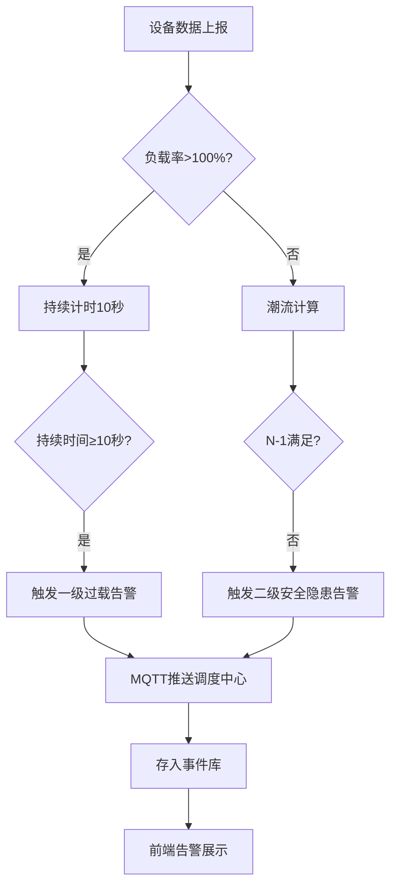

## 1. 产品概述

城市轨道交通供电系统数字孪生平台，为地铁调度中心提供全网供电系统的实时三维可视化监控、潮流计算仿真与智能告警能力。系统接入3条线路、60座牵引变电站、200台整流器和400台直流开关柜的秒级IEC 61850数据，实现供电网络全息感知与故障预警。

- 目标用户：地铁供电调度中心运维人员
- 核心价值：从被动响应转向主动预警，通过数字孪生与潮流仿真实现N-1故障预判与负荷转移决策支持

## 2. 核心功能

### 2.1 用户角色

| 角色 | 注册方式 | 核心权限 |
|------|----------|----------|
| 调度员 | 内部账号分配 | 实时监控、设备操作、告警确认 |
| 系统管理员 | 内部账号分配 | 系统配置、用户管理、数据维护 |

### 2.2 功能模块

1. **三维拓扑监控页面**：全网供电网络三维可视化、设备状态着色、馈线连接、点击交互
2. **设备详情面板**：电气参数趋势图、操作历史、实时数据
3. **潮流仿真模块**：牛顿-拉夫逊潮流计算、N-1故障场景分析、负荷转移建议
4. **告警管理页面**：一级过载告警、二级供电安全隐患告警、MQTT推送
5. **指标仪表板**：全网功率总加、线路损耗、电压合格率

### 2.3 页面详情

| 页面名称 | 模块名称 | 功能描述 |
|----------|----------|----------|
| 三维拓扑监控页 | 3D拓扑视图 | Three.js渲染供电网络三维拓扑，变电站立方体、馈线线条，颜色随负载率变化（绿<60%、黄60%-80%、红>80%） |
| 三维拓扑监控页 | 顶部指标栏 | 全网功率总加(MW)、线路损耗(MW)、电压合格率(%)实时展示 |
| 三维拓扑监控页 | 设备详情弹窗 | 点击设备弹出面板，显示近2小时电压/电流/功率/温度趋势曲线和设备操作历史 |
| 三维拓扑监控页 | 故障闪烁标注 | N-1故障场景中过载馈线红色闪烁，显示负荷转移建议 |
| 潮流仿真页 | 仿真控制面板 | 触发潮流计算、选择N-1故障设备、查看计算结果 |
| 潮流仿真页 | 结果展示 | 潮流分布图、越限设备列表、负荷转移建议 |
| 告警管理页 | 告警列表 | 一级过载告警和二级供电安全隐患告警列表，含时间、设备、详情 |
| 告警管理页 | 告警详情 | 告警关联设备参数、处理建议、确认操作 |

## 3. 核心流程

### 3.1 实时监控流程

1. IEC 61850模拟器每秒上报660台设备的电压、电流、功率、温度数据
2. Go后端接收数据写入InfluxDB，同时计算负载率并更新设备状态
3. 前端通过WebSocket接收实时状态更新，Three.js拓扑图设备颜色实时变化
4. 负载率超过100%持续10秒触发一级过载告警

### 3.2 潮流仿真流程

1. 调度员触发潮流计算或系统定时执行
2. 后端基于实时拓扑和负载数据构建导纳矩阵
3. 牛顿-拉夫逊法迭代求解全网潮流分布
4. 执行N-1故障扫描，逐一断开馈线评估影响
5. 发现馈线故障导致其他馈线过载时，红色闪烁标注并生成负荷转移建议
6. N-1不满足时触发二级供电安全隐患告警

### 3.3 告警流程

## 4. 用户界面设计

### 4.1 设计风格

- 主色调：深蓝(#0A1628)背景 + 科技蓝(#00D4FF)强调色，工业监控风格
- 辅助色：绿色(#00FF88)正常、黄色(#FFB800)预警、红色(#FF3344)告警
- 按钮风格：圆角4px、半透明背景、发光边框
- 字体：Rajdhani(标题/数据) + Source Sans 3(正文)，等宽数据显示
- 布局风格：深色工业风、左侧导航栏、顶部指标条、中央3D视图
- 图标：线性图标，2px描边，发光效果

### 4.2 页面设计概述

| 页面名称 | 模块名称 | UI元素 |
|----------|----------|--------|
| 三维拓扑监控页 | 3D拓扑视图 | 深色背景、变电站立方体(发光边缘)、馈线发光线条、设备颜色按负载率渐变、鼠标悬停高亮、旋转缩放交互 |
| 三维拓扑监控页 | 顶部指标栏 | 三个指标卡片横排，数字大字号等宽字体，微动画数字跳动 |
| 三维拓扑监控页 | 设备详情弹窗 | 右侧滑出面板，Canvas趋势图(2小时)、操作历史时间轴、实时参数数值面板 |
| 三维拓扑监控页 | 故障标注 | 红色脉冲闪烁动画、三角形警告图标、建议文字气泡 |
| 告警管理页 | 告警列表 | 左右分栏，左侧告警列表(红/橙边框)，右侧告警详情 |

### 4.3 响应式设计

- 桌面优先，最低支持1920x1080分辨率
- 3D视图区域自适应，指标栏和面板固定布局
- 大屏(4K)增强细节和可视范围

### 4.4 3D场景指导

- 环境：深色科技风，微弱环境光 + 点光源模拟变电站在暗色背景中的发光效果
- 灯光：柔和环境光(0.3) + 设备自发光(根据负载率颜色) + 馈线发光效果
- 相机：45度俯视等轴视角，支持OrbitControls旋转缩放，默认视角覆盖全网
- 构图：3条线路从左到右排列，变电站沿线路分布，馈线连接相邻变电站
- 交互：点击设备弹出面板、悬停高亮、滚轮缩放、拖拽旋转
- 后处理：Bloom发光效果(馈线和告警设备)、边缘发光
- 性能预算：LOD优化，60FPS目标，实例化渲染设备
