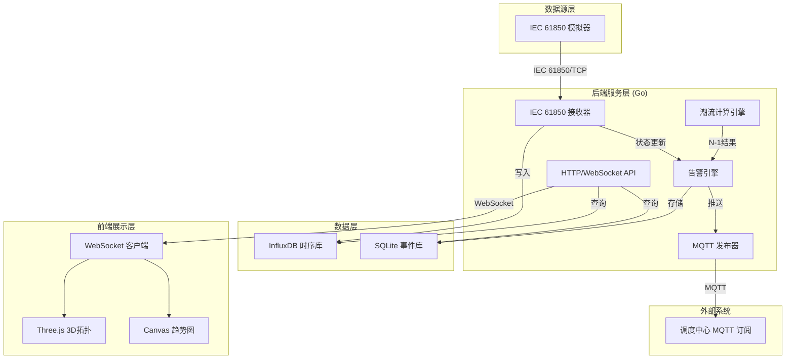
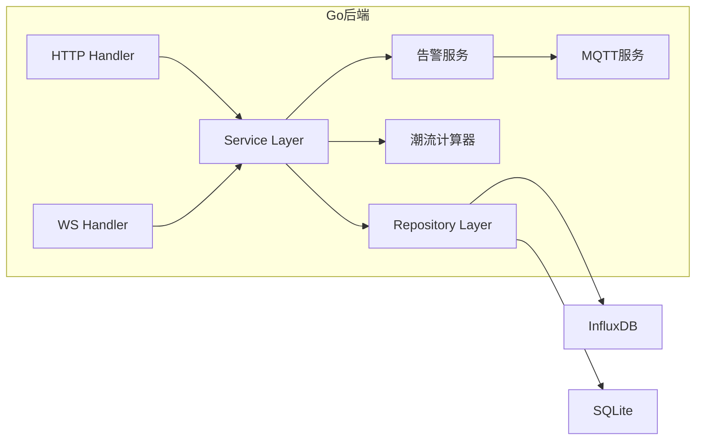
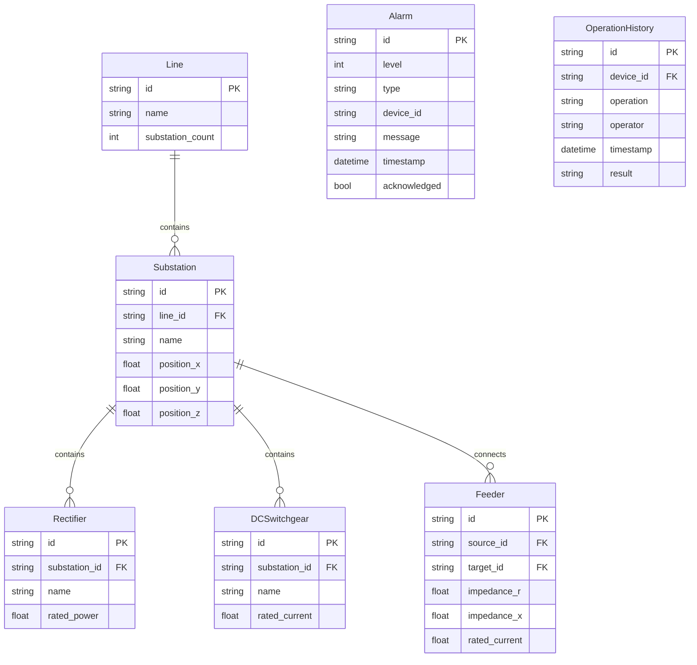

## 1. 架构设计



## 2. 技术说明

- **前端**：React 18 + Vite + TailwindCSS 3 + Three.js + @react-three/fiber + @react-three/drei
- **初始化工具**：Vite
- **后端**：Go 1.21+ (net/http + gorilla/websocket)
- **时序数据库**：InfluxDB 2.x (设备遥测数据)
- **事件数据库**：SQLite (告警事件、操作历史)
- **消息队列**：MQTT (Eclipse Paho)
- **数据协议**：IEC 61850 (模拟TCP上报)

## 3. 路由定义

| 路由 | 用途 |
|------|------|
| `/` | 三维拓扑监控主页 |
| `/alarms` | 告警管理页面 |
| `/simulation` | 潮流仿真页面 |

## 4. API定义

### 4.1 REST API

```typescript
interface DeviceTelemetry {
  device_id: string
  device_type: "substation" | "rectifier" | "dc_switchgear"
  voltage: number
  current: number
  power: number
  temperature: number
  load_rate: number
  timestamp: string
}

interface TopologyNode {
  id: string
  name: string
  type: "substation" | "rectifier" | "dc_switchgear"
  line_id: string
  position: { x: number; y: number; z: number }
  load_rate: number
  status: "normal" | "warning" | "alarm"
}

interface TopologyEdge {
  id: string
  source: string
  target: string
  type: "feeder" | "busbar"
  load_rate: number
  status: "normal" | "warning" | "alarm" | "fault"
}

interface PowerFlowResult {
  timestamp: string
  converged: boolean
  iterations: number
  node_voltages: Record<string, number>
  branch_powers: Record<string, number>
  losses: number
  n1_results: N1Result[]
}

interface N1Result {
  fault_branch: string
  overloads: string[]
  safe: boolean
  transfer_suggestion: string | null
}

interface Alarm {
  id: string
  level: 1 | 2
  type: "overload" | "n1_violation"
  device_id: string
  message: string
  timestamp: string
  acknowledged: boolean
}

interface KPIMetrics {
  total_power_mw: number
  line_loss_mw: number
  voltage_qualified_rate: number
  timestamp: string
}
```

### 4.2 API端点

| 方法 | 路径 | 描述 |
|------|------|------|
| GET | `/api/topology` | 获取全网拓扑结构 |
| GET | `/api/devices/:id/telemetry?range=2h` | 获取设备遥测历史 |
| GET | `/api/devices/:id/history` | 获取设备操作历史 |
| POST | `/api/simulation/powerflow` | 触发潮流计算 |
| POST | `/api/simulation/n1` | 触发N-1分析 |
| GET | `/api/alarms` | 获取告警列表 |
| PUT | `/api/alarms/:id/acknowledge` | 确认告警 |
| GET | `/api/metrics/kpi` | 获取KPI指标 |
| WS | `/ws` | WebSocket实时推送 |

## 5. 服务器架构图



## 6. 数据模型

### 6.1 数据模型定义



### 6.2 数据定义语言

**InfluxDB Bucket: `power_telemetry`**

```
// Measurement: device_telemetry
// Tag: device_id, device_type, line_id
// Field: voltage(V), current(A), power(W), temperature(C), load_rate(%)
```

**SQLite DDL:**

```sql
CREATE TABLE IF NOT EXISTS lines (
    id TEXT PRIMARY KEY,
    name TEXT NOT NULL,
    substation_count INTEGER NOT NULL
);

CREATE TABLE IF NOT EXISTS substations (
    id TEXT PRIMARY KEY,
    line_id TEXT NOT NULL REFERENCES lines(id),
    name TEXT NOT NULL,
    position_x REAL NOT NULL,
    position_y REAL NOT NULL,
    position_z REAL NOT NULL
);

CREATE TABLE IF NOT EXISTS rectifiers (
    id TEXT PRIMARY KEY,
    substation_id TEXT NOT NULL REFERENCES substations(id),
    name TEXT NOT NULL,
    rated_power REAL NOT NULL
);

CREATE TABLE IF NOT EXISTS dc_switchgears (
    id TEXT PRIMARY KEY,
    substation_id TEXT NOT NULL REFERENCES substations(id),
    name TEXT NOT NULL,
    rated_current REAL NOT NULL
);

CREATE TABLE IF NOT EXISTS feeders (
    id TEXT PRIMARY KEY,
    source_id TEXT NOT NULL REFERENCES substations(id),
    target_id TEXT NOT NULL REFERENCES substations(id),
    impedance_r REAL NOT NULL,
    impedance_x REAL NOT NULL,
    rated_current REAL NOT NULL
);

CREATE TABLE IF NOT EXISTS alarms (
    id TEXT PRIMARY KEY,
    level INTEGER NOT NULL,
    type TEXT NOT NULL,
    device_id TEXT NOT NULL,
    message TEXT NOT NULL,
    timestamp DATETIME NOT NULL,
    acknowledged INTEGER DEFAULT 0
);

CREATE TABLE IF NOT EXISTS operation_history (
    id TEXT PRIMARY KEY,
    device_id TEXT NOT NULL,
    operation TEXT NOT NULL,
    operator TEXT NOT NULL,
    timestamp DATETIME NOT NULL,
    result TEXT NOT NULL
);
```
