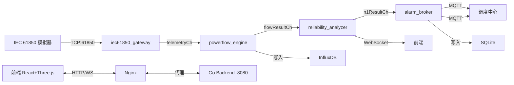

# 城市轨道交通供电系统数字孪生平台

## 项目概述

城市轨道交通供电系统数字孪生平台是一个面向地铁直流1500V牵引供电系统的实时监控与仿真平台。平台通过 IEC 61850 协议适配层采集设备遥测数据，经过牛顿-拉夫逊潮流计算和 N-1 故障扫描，实现供电系统可靠性评估与两级告警推送，并通过 Three.js 三维拓扑可视化界面直观展示系统运行状态。

核心能力：
- **实时数据采集**：IEC 61850 TCP 协议适配，支持 660+ 设备并发遥测
- **潮流计算**：牛顿-拉夫逊法求解直流潮流，30秒周期自动计算
- **N-1 可靠性评估**：自动扫描单故障场景，评估系统安全性
- **两级告警**：一级越限告警 + 二级 N-1 风险告警，MQTT 推送至调度中心
- **三维可视化**：Three.js 供电拓扑三维展示 + 设备仪表盘

## 系统架构



### 模块说明

| 模块 | 职责 |
|------|------|
| `iec61850_gateway` | IEC 61850 协议适配 + 数据采集，监听 TCP:61850 接收遥测数据，通过 channel 分发至下游 |
| `powerflow_engine` | 牛顿-拉夫逊潮流计算引擎，30秒周期执行，将潮流结果写入 InfluxDB 并推送给可靠性分析器 |
| `reliability_analyzer` | N-1 故障扫描 + 可靠性评估，逐条断开支路检验系统安全性，生成负荷转移建议 |
| `alarm_broker` | 两级告警评估 + MQTT 推送，一级基于实时越限检测，二级基于 N-1 分析结果，同时通过 WebSocket 推送前端 |
| 前端 | React + Three.js 三维供电拓扑 + 设备仪表盘 + 告警面板 + 趋势图表 |

## 技术栈

| 层次 | 技术 |
|------|------|
| 后端 | Go 1.21+ |
| 前端 | React 18 + TypeScript + Three.js + TailwindCSS |
| 时序数据库 | InfluxDB 2.7 |
| 消息队列 | MQTT (Eclipse Mosquitto) |
| 关系数据库 | SQLite |
| 容器化 | Docker + Docker Compose |
| 可观测性 | Prometheus + pprof |

## 快速部署

### 前置条件

- Docker 20.10+
- Docker Compose V2

### 启动服务

```bash
cd scripts
docker compose up -d

# 查看后端日志
docker compose logs -f backend

# 等待所有服务就绪后查看状态
docker compose ps
```

### 访问地址

| 服务 | 地址 | 说明 |
|------|------|------|
| 前端界面 | http://localhost:3000 | 三维拓扑 + 仪表盘 |
| 后端 API | http://localhost:8080/api/topology | REST API |
| InfluxDB UI | http://localhost:8086 | 账号: admin / admin123456 |
| Prometheus 指标 | http://localhost:8080/metrics | Go 运行时指标 |
| IEC 61850 端口 | tcp://localhost:61850 | 模拟器接入 |

## 手动部署

### 1. 启动基础设施

```bash
# InfluxDB
docker run -d --name influxdb \
  -p 8086:8086 \
  -e DOCKER_INFLUXDB_INIT_MODE=setup \
  -e DOCKER_INFLUXDB_INIT_USERNAME=admin \
  -e DOCKER_INFLUXDB_INIT_PASSWORD=admin123456 \
  -e DOCKER_INFLUXDB_INIT_ORG=power-twin \
  -e DOCKER_INFLUXDB_INIT_BUCKET=power_telemetry \
  -e DOCKER_INFLUXDB_INIT_RETENTION=30d \
  -e DOCKER_INFLUXDB_INIT_ADMIN_TOKEN=power-twin-admin-token-2024 \
  influxdb:2.7

# MQTT Broker
docker run -d --name mosquitto \
  -p 1883:1883 \
  eclipse-mosquitto:2
```

### 2. 编译运行 Go 后端

```bash
cd backend

# 设置环境变量
export INFLUXDB_URL=http://localhost:8086
export INFLUXDB_TOKEN=power-twin-admin-token-2024
export INFLUXDB_ORG=power-twin
export INFLUXDB_BUCKET=power_telemetry
export MQTT_BROKER=tcp://localhost:1883
export TCP_LISTEN_ADDR=0.0.0.0:61850
export HTTP_LISTEN_ADDR=0.0.0.0:8080

# 编译运行
go run cmd/main.go
```

### 3. 编译运行前端

```bash
cd frontend
npm install
npm run build

# 使用任意静态服务器托管 dist/ 目录，或开发模式运行
npm run dev
```

### 4. 启动模拟器

```bash
python scripts/iec61850_simulator.py --host localhost --port 61850
```

## 模拟器用法

IEC 61850 模拟器通过 TCP 协议向 Go 后端发送设备遥测数据，支持丰富的配置参数。

### 基本用法

```bash
# 默认配置：60个变电站、每站10个设备、1秒间隔
python scripts/iec61850_simulator.py --host localhost --port 61850

# 使用配置文件
python scripts/iec61850_simulator.py --config scripts/simulator_config.json

# 故障注入模式（提高异常概率）
python scripts/iec61850_simulator.py --fault-mode --abnormal-probability 0.3

# 自定义参数
python scripts/iec61850_simulator.py --substations 30 --devices-per-sub 5 --interval 2.0

# Dry run 验证配置（不连接后端，打印一批遥测数据到标准输出）
python scripts/iec61850_simulator.py --dry-run

# 使用故障测试配置文件
python scripts/iec61850_simulator.py --config scripts/simulator_config_fault.json
```

### 配置优先级

CLI 参数 > 配置文件 > 内置默认值

当 `--config` 指定配置文件时，文件中的值覆盖默认值；但 CLI 显式指定的参数优先级最高。

`--fault-mode` 标志会将 `abnormal_probability` 强制设为至少 0.20。

### 参数说明

| 参数 | 类型 | 默认值 | 说明 |
|------|------|--------|------|
| `--host` | string | localhost | Go 后端 TCP 主机地址 |
| `--port` | int | 61850 | Go 后端 TCP 端口 |
| `--interval` | float | 1.0 | 发送间隔（秒） |
| `--substations` | int | 60 | 变电站数量 |
| `--devices-per-sub` | int | 10 | 每个变电站下的设备数（不含变电站自身） |
| `--lines` | int | 3 | 地铁线路数 |
| `--fault-mode` | flag | off | 故障注入模式，提高过载概率 |
| `--normal-load-min` | float | 30 | 正常负荷率下限 % |
| `--normal-load-max` | float | 70 | 正常负荷率上限 % |
| `--abnormal-load-min` | float | 105 | 异常负荷率下限 % |
| `--abnormal-load-max` | float | 120 | 异常负荷率上限 % |
| `--abnormal-probability` | float | 0.05 | 异常负荷概率 (0.0-1.0) |
| `--voltage-nominal` | float | 1500 | 标称电压 V |
| `--voltage-stddev` | float | 25 | 电压标准差 |
| `--voltage-dip-probability` | float | 0.02 | 电压骤降概率 |
| `--config` | string | - | JSON 配置文件路径 |
| `--dry-run` | flag | off | 仅打印一批遥测数据，不连接后端 |

### 设备命名规则

- 变电站：`SUB_L{线路}_{序号:02d}`，如 `SUB_L1_01`
- 变电站下设备：`DEV_L{线路}_{变电站序号:02d}_{设备序号:02d}`，如 `DEV_L1_01_01` ~ `DEV_L1_01_10`
- 设备类型循环：rectifier、dc_switchgear、rectifier、dc_switchgear...
- 总设备数 = 变电站数 + 变电站数 × 每站设备数

### 配置文件格式

```json
{
  "substations": 60,
  "devices_per_sub": 10,
  "lines": 3,
  "interval": 1.0,
  "normal_load_min": 30,
  "normal_load_max": 70,
  "abnormal_load_min": 105,
  "abnormal_load_max": 120,
  "abnormal_probability": 0.05,
  "voltage_nominal": 1500,
  "voltage_stddev": 25,
  "voltage_dip_probability": 0.02
}
```

## 监控与调优

### pprof 性能分析

```bash
# CPU profile（采集30秒）
go tool pprof http://localhost:8080/debug/pprof/profile?seconds=30

# 内存 profile
go tool pprof http://localhost:8080/debug/pprof/heap

# Goroutine 分析
go tool pprof http://localhost:8080/debug/pprof/goroutine
```

### Prometheus 指标

```bash
# 查看指标
curl http://localhost:8080/metrics

# 关键指标
# go_goroutines - 当前 goroutine 数量
# go_memstats_alloc_bytes - 内存分配量
# process_cpu_seconds_total - CPU 使用时间
```

## InfluxDB 数据策略

### 数据保留与降采样

| Bucket | 保留期限 | 聚合粒度 | 用途 |
|--------|----------|----------|------|
| `power_telemetry` | 30天 | 原始数据（1秒级） | 实时监控与告警 |
| `telemetry_downsampled` | 90天 | 5分钟聚合 | 趋势分析与报表 |
| `telemetry_archive` | 365天 | 1小时聚合 | 长期归档与审计 |

### 降采样 Task 示例

```flux
// 5分钟降采样任务
option task = {name: "downsample-5m", every: 5m}

from(bucket: "power_telemetry")
  |> range(start: -5m)
  |> filter(fn: (r) => r._measurement == "device_telemetry")
  |> aggregateWindow(every: 5m, fn: mean, createEmpty: false)
  |> to(bucket: "telemetry_downsampled", org: "power-twin")
```

## 配置说明

### 环境变量

| 环境变量 | 默认值 | 说明 |
|----------|--------|------|
| `INFLUXDB_URL` | http://localhost:8086 | InfluxDB 连接地址 |
| `INFLUXDB_TOKEN` | my-token | InfluxDB API Token |
| `INFLUXDB_ORG` | power-twin | InfluxDB 组织名 |
| `INFLUXDB_BUCKET` | telemetry | InfluxDB Bucket 名 |
| `MQTT_BROKER` | tcp://localhost:1883 | MQTT Broker 地址 |
| `TCP_LISTEN_ADDR` | 0.0.0.0:61850 | IEC 61850 TCP 监听地址 |
| `HTTP_LISTEN_ADDR` | 0.0.0.0:8080 | HTTP API 监听地址 |

### N-1 分析配置 (config.json)

| 参数 | 默认值 | 说明 |
|------|--------|------|
| `max_iterations` | 50 | 潮流计算最大迭代次数 |
| `tolerance` | 1e-6 | 潮流计算收敛精度 |
| `overload_threshold` | 100.0 | 过载判定阈值 % |
| `overload_duration_sec` | 10 | 过载持续时间阈值（秒） |
| `scan_interval_sec` | 30 | N-1 扫描间隔（秒） |
| `powerflow_interval_sec` | 30 | 潮流计算间隔（秒） |
| `base_voltage` | 1500.0 | 基准电压 V |
| `voltage_min_pu` | 0.9 | 电压下限标幺值 |
| `voltage_max_pu` | 1.1 | 电压上限标幺值 |
| `feeder_capacity_ratio` | 0.8 | 馈线容量利用率阈值 |

## 项目结构

```
.
├── backend/                          # Go 后端
│   ├── cmd/
│   │   └── main.go                   # 程序入口
│   ├── internal/
│   │   ├── alarm_broker/
│   │   │   └── broker.go             # 两级告警评估 + MQTT 推送
│   │   ├── config/
│   │   │   └── n1_config.go          # N-1 分析配置
│   │   ├── handler/
│   │   │   ├── api.go                # REST API 处理器
│   │   │   └── websocket.go          # WebSocket 推送
│   │   ├── iec61850_gateway/
│   │   │   └── gateway.go            # IEC 61850 协议适配 + 数据采集
│   │   ├── model/
│   │   │   └── model.go              # 数据模型定义
│   │   ├── mqtt/
│   │   │   └── publisher.go          # MQTT 消息发布
│   │   ├── powerflow/
│   │   │   ├── newton_raphson.go     # 牛顿-拉夫逊潮流计算
│   │   │   └── n1_analysis.go        # N-1 故障分析
│   │   ├── powerflow_engine/
│   │   │   └── engine.go             # 潮流计算引擎
│   │   ├── reliability_analyzer/
│   │   │   └── analyzer.go           # 可靠性分析器
│   │   ├── repository/
│   │   │   ├── influxdb.go           # InfluxDB 时序数据存储
│   │   │   └── sqlite.go             # SQLite 关系数据存储
│   │   └── service/
│   │       └── topology.go           # 拓扑服务
│   ├── config.json                   # N-1 分析配置文件
│   └── go.mod                        # Go 模块定义
├── frontend/                         # React 前端
│   ├── src/
│   │   ├── components/
│   │   │   ├── AlarmBadge.tsx         # 告警徽章组件
│   │   │   ├── DeviceDashboard.tsx    # 设备仪表盘
│   │   │   ├── DevicePanel.tsx        # 设备面板
│   │   │   ├── FeederLine.tsx         # 馈线组件
│   │   │   ├── KPIBar.tsx             # KPI 指标栏
│   │   │   ├── Power3DViewer.tsx      # 三维场景查看器
│   │   │   ├── SubstationNode.tsx     # 变电站节点
│   │   │   ├── Topology3D.tsx         # 三维拓扑主组件
│   │   │   └── TrendChart.tsx         # 趋势图表
│   │   ├── hooks/
│   │   │   └── useWebSocket.ts       # WebSocket Hook
│   │   ├── pages/
│   │   │   ├── AlarmPage.tsx          # 告警页面
│   │   │   ├── SimulationPage.tsx     # 仿真页面
│   │   │   └── TopologyPage.tsx       # 拓扑页面
│   │   ├── store/
│   │   │   └── useStore.ts           # 状态管理
│   │   ├── utils/
│   │   │   └── api.ts                # API 工具
│   │   ├── App.tsx                    # 应用入口
│   │   ├── index.css                  # 全局样式
│   │   └── main.tsx                   # 渲染入口
│   ├── index.html                     # HTML 模板
│   ├── package.json                   # 前端依赖
│   ├── tailwind.config.js             # TailwindCSS 配置
│   ├── tsconfig.json                  # TypeScript 配置
│   └── vite.config.ts                 # Vite 构建配置
├── scripts/                           # 运维脚本
│   ├── iec61850_simulator.py          # IEC 61850 模拟器
│   ├── simulator_config.json          # 默认模拟器配置
│   ├── simulator_config_fault.json    # 故障测试配置
│   ├── docker-compose.yml             # Docker Compose 编排
│   ├── Dockerfile.simulator           # 模拟器 Docker 镜像
│   ├── influxdb_init.sh               # InfluxDB 初始化 (Linux/Mac)
│   ├── influxdb_init.ps1              # InfluxDB 初始化 (Windows)
│   ├── start.sh                       # 一键启动脚本 (Linux/Mac)
│   └── start.ps1                      # 一键启动脚本 (Windows)
└── README.md                          # 项目文档
```
